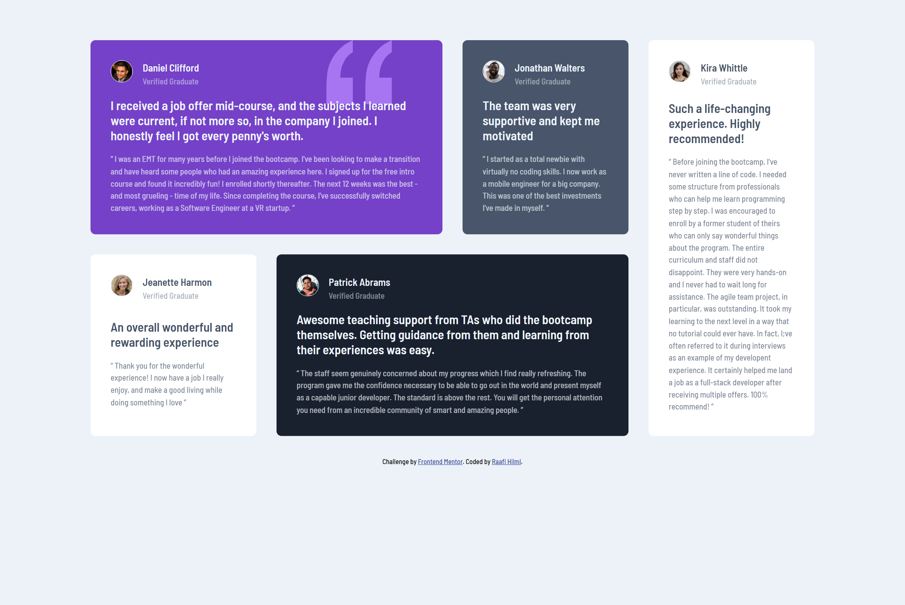

# Frontend Mentor - Testimonials grid section solution

This is a solution to the [Testimonials grid section challenge on Frontend Mentor](https://www.frontendmentor.io/challenges/testimonials-grid-section-Nnw6J7Un7). Frontend Mentor challenges help you improve your coding skills by building realistic projects.

## Table of contents

- [Overview](#overview)
  - [The challenge](#the-challenge)
  - [Screenshot](#screenshot)
  - [Links](#links)
- [My process](#my-process)
  - [Built with](#built-with)
  - [What I learned](#what-i-learned)
  - [Useful resources](#useful-resources)
- [Author](#author)

**Note: Delete this note and update the table of contents based on what sections you keep.**

## Overview

### The challenge

Users should be able to:

- View the optimal layout for the site depending on their device's screen size

### Screenshot



### Links

- Live Site URL: [Testimoni Grid](https://testigrid.inicoding.live/)

## My process

### Built with

- Semantic HTML5 markup
- CSS custom properties
- CSS Grid
- Mobile-first workflow

### What I learned

Designing a website layout using a grid.

```css
.testimonial:nth-child(5) {
  grid-column: 4/5;
  grid-row: 1 / span 2;
}
```

### Useful resources

- [Grid CSS](https://css-tricks.com/snippets/css/complete-guide-grid/) - This is an amazing article which helped me finally understand Grid. I'd recommend it to anyone still learning this concept.

## Author

- Website - [Raafi Hilmi](https://inicoding.live)
- Frontend Mentor - [@raafihilmi](https://www.frontendmentor.io/profile/raafihilmi)
